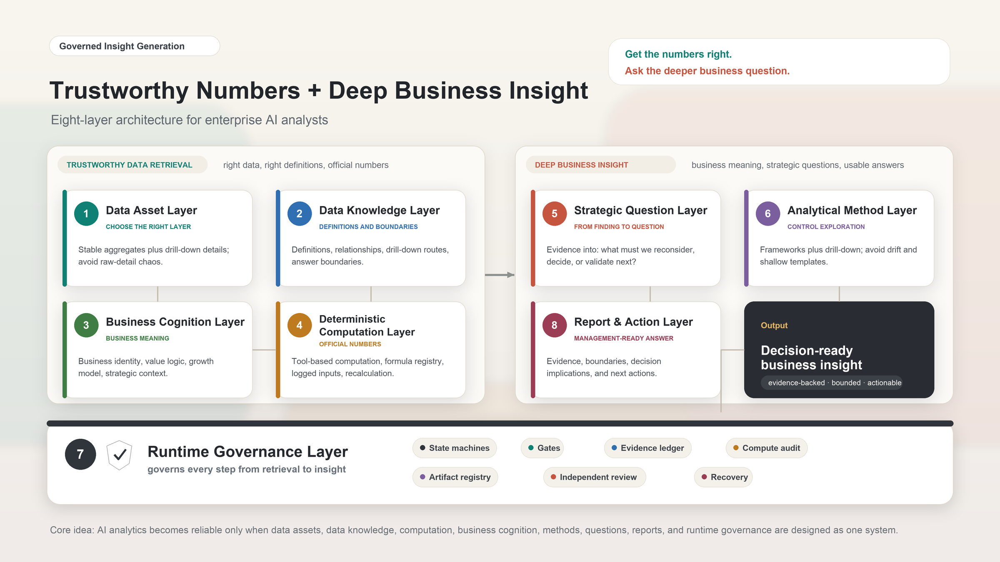

# Trustworthy Numbers, Deeper Business Questions: An Eight-Layer Architecture for Enterprise AI Analysts

> Get the numbers right. Ask the deeper business question.
>

> Note: all examples in this article are synthetic. They do not refer to any real business, metric, data table, or internal system.
>

Author: Eric Young-ANT Group (Ericyang.nna@gmail.com)

## 1. Not Just Text-to-SQL: Trustworthy Numbers and Deeper Business Questions
Over the past two years, many enterprise AI analytics efforts have started with the same question: can a model turn a natural-language question into the right SQL?

That question matters. But it is not the real center of the problem.

Enterprise AI analytics is not simply Text-to-SQL. Nor is it a dashboard with a chat box attached. The real task is to make AI operate within a governed stack of data assets, data knowledge, deterministic computation, and business cognition, so it can get the numbers right, ask the deeper business question, and produce insights that genuinely support management decisions.

This does not make Text-to-SQL unimportant. It is an important entry point. It is just not the whole analytical capability.

Two requirements matter most: get the numbers right, and ask the deeper question.

Getting the numbers right does not happen just because a model is connected to a database. The system needs to know which data layer to use, how each metric is defined, when two numbers can be compared, who computes derived metrics, and which questions are not answerable as asked and therefore need clarification, more evidence, or a narrower answer.

Asking the deeper question is not the same as writing a longer summary or a better-looking report. It means putting metric changes back into the business context and asking: what does this force us to reconsider?

Real enterprise analytics is not a straight line from “one question” to “one SQL query” to “one chart.” It involves a chain of judgments. Should the system use an aggregate table or a detail table? Can this metric be compared across periods? Is the change a real improvement or a structural shift? Which business assumption is being challenged by the evidence? Should the company adjust resources, pace, targets, or validation priorities?

Consider a synthetic example. The numbers below are indices and do not refer to any real business data.

In a membership business, suppose the active-user index rises from 100 to 128. A weak AI analyst might write:

> Active users increased significantly this period, which shows that the membership operation strategy is working. We recommend increasing investment.
>

The problem is not only that the conclusion is shallow. It treats an aggregate activity metric as evidence of business quality, while skipping value behavior, retention, and structural change.

Now suppose the high-value behavior index rises only from 100 to 103, high-value behavior per user falls from 100 to 80, and next-period retention falls from 100 to 91. The real question is no longer “did active users grow?” It becomes:

> Is the current growth expanding the base of genuinely high-value members, or is it using low-sustainability activity metrics to hide a decline in growth quality?
>

That is the central point of this article: get the numbers right, and ask the deeper business question. The first keeps AI from building on the wrong evidence. The second keeps AI from dressing up surface-level movement as insight.

## 2. Why This Is a System Problem
The hard part of enterprise AI analytics is not one isolated model capability. It is the handoff between steps.

First, the system must be clear about where the numbers come from and why they are trustworthy. AI needs to know which data layer to use, which definitions to follow, which indicators can be compared, and which questions are not answerable as asked. Otherwise, the analysis can be built on the wrong evidence from the very beginning.

Recent work such as [Spider 2.0](https://arxiv.org/abs/2411.07763), [EntSQL](https://arxiv.org/abs/2606.03363), and [Beyond Text-to-SQL](https://arxiv.org/abs/2605.21027) points in the same direction: in real enterprise settings, models face not only SQL syntax, but also metadata, business documents, internal rules, multi-step interaction, and governed interfaces. For enterprises, the takeaway is simple: letting a model write SQL covers only a narrow part of the analytical chain.

Second, the system must understand what the numbers mean. AI should not merely summarize metric changes. It needs to connect those changes to business assumptions, possible explanations, and management actions. Otherwise, it will wrap surface-level findings in the language of insight.

Third, the process must be governed while it runs. Evidence, computation, question generation, and report language all need constraints and review. A long analytical workflow can drift even when the initial prompt looks carefully written.

The next stage of competition, then, is not only “whose SQL generation is more accurate.” It is “who can connect data retrieval, business cognition, and runtime governance well enough to produce deep business insights repeatedly.”

This overview makes three claims:

1. Enterprise AI analytics should not stop at Text-to-SQL. It should move toward trustworthy data retrieval plus deep business insight.
2. To get there, data assets, data knowledge, deterministic computation, business cognition, analytical methods, strategic questions, report delivery, and runtime governance must be designed as one system.
3. A useful enterprise AI analyst must get the numbers right, ask the deeper question, and make key conclusions supported by evidence, properly bounded, and usable in management discussions.

## 3. Governed Insight Generation
I use the term Governed Insight Generation for this direction.

It is not a dashboard with a better chat interface. It is not a stronger SQL generator. It is a way of producing enterprise analysis: govern the data, definitions, computation, business cognition, and evidence chain first, then let AI generate insight from that governed chain.

New benchmarks are also beginning to evaluate multi-step insight generation by business analytics agents, rather than only the correctness of a single query. [InsightBench](https://proceedings.iclr.cc/paper_files/paper/2025/hash/0dfe31d6e703e138d46a7d2fced38b7c-Abstract-Conference.html) is one example. But in enterprise practice, the questions become more concrete: who guarantees that the data is trustworthy, who guarantees that the computation is trustworthy, and what keeps the insight from being fabricated?

This framing also comes from practice. In sanitized enterprise analytics evaluations, we have repeatedly seen the same pattern: with the same question and the same model, output quality changes sharply depending on the data layer, data knowledge, business cognition, and analytical workflow.

Give the model only raw detail tables, and it gets dragged into definitions, joins, and computation. Give it only aggregate metrics, and it struggles to explain anomalies. Remove business cognition, and it mistakes metric movement for business judgment. Remove runtime governance, and it may draw conclusions without evidence or calculate official metrics inside the prose. The output becomes usable in management settings only when stable metrics, drill-down details, data knowledge, deterministic computation, business cognition, and runtime review work together.

The difference from common AI analytics patterns is this:

| Form | Core capability | Value | Limitation |
| --- | --- | --- | --- |
| Text-to-SQL | Natural language to query | Lowers the barrier to asking data questions | Does not handle business judgment, question generation, or report governance |
| Conversational BI | Conversational chart exploration and follow-up questions | Improves dashboard interaction | Does not by itself organize evidence or form management-level questions |
| Semantic Layer Copilot | Maps metrics, dimensions, and relationships | Reduces schema misuse and metric-definition errors | Still does not provide business cognition or strategic judgment |
| Governed Insight Generation | Governed insight-production chain | Trustworthy data retrieval + deep business insight | Cannot replace decisions made by business owners or skip evidence review |

In short: Text-to-SQL solves “from language to query.” The semantic layer solves “from query to correct definitions.” Governed Insight Generation solves “from evidence to a business judgment managers can act on.”

## 4. The Eight-Layer Architecture
To make this possible, enterprises need at least eight layers of capability.

| Layer | Core question | Common failure mode | System solution |
| --- | --- | --- | --- |
| 1. Data Asset Layer | Which data layer should AI use? | AI queries raw detail tables directly, leading to high cost, messy definitions, and poor reproducibility. | Separate simple data questions from complex analysis; for complex analysis, use stable aggregate layers plus drill-down detail layers. |
| 2. Data Knowledge Layer | How does AI know how to use tables, fields, and metrics? | Field names look clear, but aggregation rules, relationships, and boundaries are wrong. | Maintain definitions, use cases, relationships, drill-down routes, and “not answerable as asked” boundaries. |
| 3. Business Cognition Layer | How does AI understand the business behind the numbers? | AI only restates changes, fabricates causes, or misses the business meaning. | Build knowledge about business identity, value creation, economic model, growth model, and strategic context. |
| 4. Deterministic Computation Layer | Who computes official numbers? | The LLM is allowed to calculate growth rates, ratios, and contribution. | Use tools for computation, register formulas, log inputs and outputs, and run independent recalculation. |
| 5. Strategic Question Layer | How can AI ask the question that truly matters? | AI turns a finding into a headline. | Connect business assumptions, current evidence, judgment space, and management actions. |
| 6. Analytical Method Layer | How can AI avoid both drift and rigidity? | Free exploration diffuses; fixed templates stay superficial. | Combine fixed analytical frameworks with free drill-down. |
| 7. Runtime Governance Layer | How is AI constrained and reviewed? | The prompt states requirements, but execution drifts. | Use state machines, gates, evidence ledgers, artifacts, independent review, and recovery protocols. |
| 8. Report and Action Layer | Can the report be used by management? | The report looks complete but has no answer, no boundary, and no decision implication. | Use answer cards, evidence boundaries, decision implications, and executive-facing conclusions. |

These eight layers are not simply product modules. They are links in a chain. Each link must be owned and made reliable. If any layer is missing, AI can still produce analysis that sounds reasonable but is not actually usable.

This architecture is also the roadmap for the rest of the series. After this overview, the series moves from foundation to delivery:

1. Data Asset Layer: which data layer should AI use?
2. Data Knowledge Layer: how does AI understand definitions, use cases, relationships, drill-down routes, and answer boundaries?
3. Business Cognition Layer: once the number has been retrieved, how does AI understand its business meaning?
4. Deterministic Computation Layer: why should official business numbers not be calculated by an LLM?
5. Strategic Question Layer: how can a finding become a strategic question?
6. Analytical Method Layer: how should fixed frameworks and free drill-down work together?
7. Runtime Governance Layer: how can Harness Engineering govern evidence, computation, review, and recovery?
8. Report and Action Layer: how can analytical results become answers that management can use?

This article gives the map. The rest of the series takes one link at a time and explains why it matters, where it tends to fail, and what the system needs to provide.

## 5. Three Layers That Are Easy to Underestimate
First, the Data Knowledge Layer is not metadata. Field descriptions tell AI what exists. A real data knowledge base tells AI how a metric is calculated, when it can be used, when it cannot be used, and where to drill down when an aggregate looks abnormal.

From [Snowflake Semantic Views](https://docs.snowflake.com/en/user-guide/views-semantic/overview) and [Databricks Genie](https://docs.databricks.com/aws/en/genie) to [Quick BI Intelligent Q](https://help.aliyun.com/zh/quick-bi/product-overview/intelligentq) and [Volcengine Intelligent Data Query Agent](https://www.volcengine.com/docs/86760/1874851?lang=zh), many products are moving metrics, relationships, business knowledge, and verifiable processes to the front of the system. At minimum, this tells us that schema alone is no longer enough.

Second, the Business Cognition Layer is not a glossary. A semantic layer connects data and language. Business cognition connects numbers to how the business creates value and makes decisions. AI needs to know what good growth looks like, what bad growth looks like, how short-term revenue differs from long-term quality, which metrics are surface outcomes, and which metrics represent the assumptions that make the business work.

Third, the Strategic Question Layer is not headline generation. A finding says what happened. A strategic question asks what this forces us to reconsider. If a question cannot change resources, pace, targets, or boundaries, it is usually just a polished headline.

## 6. Why Prompts Are Not Enough
For many AI analytics systems, the problem is not an unclear prompt. The problem is that the prompt’s requirements are not enforceable.

You can write “do not fabricate,” “look at the evidence first,” “compute accurately,” and “state uncertainty” in the prompt. But if those requirements are not implemented as states, artifacts, gates, and reviews, they are only wishes.

Enterprise AI analytics needs Harness Engineering: a way to govern key analytical behaviors while the work is being done.

This concern is increasingly visible in agent research as well. Work such as [PROV-AGENT](https://arxiv.org/abs/2508.02866), [SafeAgent](https://arxiv.org/abs/2604.17562), and [From Agent Traces to Trust](https://arxiv.org/abs/2606.04990) shifts attention from “is the final answer correct?” to “can the process be traced, protected, and audited?” For enterprise analytics, the lesson is practical: trust is not the final sentence “I checked it.” Trust means the process can be traced, blocked, and recovered.

At the system level, this requires mechanisms such as:

+ Evidence Ledger: every conclusion is tied to evidence.
+ Fresh Run Isolation: current facts come from current evidence; historical knowledge provides context, not proof.
+ Compute Audit: official derived metrics are computed by tools and independently recalculated.
+ Gate: unqualified artifacts cannot move to the next stage.
+ Artifact Registry: key intermediate artifacts are stored, not left only in conversation.
+ Independent Review: review is not replaced by self-evaluation from the same primary session.
+ Recovery Protocol: when evidence is insufficient, computation fails, or review does not pass, the system can block, repair, or downgrade.

A prompt can state intent. A harness makes behavior enforceable.

## 7. Boundaries
Governed Insight Generation does not reject Text-to-SQL or the semantic layer. Text-to-SQL remains an important entry point. The semantic layer remains a necessary foundation. BI copilots will continue to improve the efficiency of data interaction.

But they are not the complete answer. If the goal is only to help users see a metric faster, natural-language data querying is already useful. If the goal is to let AI participate in real business analysis, help teams discover problems, form judgments, build shared business understanding, and produce reports that management can use, the system needs a deeper architecture.

This architecture also does not replace business owners. It helps organize evidence, raise important questions earlier, and make the analytical process more reliable.

## 8. Conclusion
The next generation of enterprise AI analytics will not simply be a dashboard with a better chat interface. It will not simply be a more accurate SQL generator.

It will look more like a governed insight-production system: one that uses the right data layer, follows definitions and boundaries, computes official numbers with deterministic tools, interprets metric movement through business cognition, raises questions worth executive attention, and writes answers with evidence, boundaries, and action implications.

The goal is not to make AI “sound smarter.” The goal is to make AI do two difficult things under system constraints: get the numbers right, and ask the deeper business question.

This is not a minor upgrade to BI interaction. It is a change in how enterprise analysis is produced: from connecting models to data entry points, to building analytical systems that can repeatedly produce deep business insight.

## References
+ [Spider 2.0](https://arxiv.org/abs/2411.07763)
+ [EntSQL](https://arxiv.org/abs/2606.03363)
+ [Beyond Text-to-SQL](https://arxiv.org/abs/2605.21027)
+ [Snowflake Semantic Views](https://docs.snowflake.com/en/user-guide/views-semantic/overview)
+ [Databricks AI/BI Genie](https://docs.databricks.com/aws/en/genie)
+ [Quick BI Intelligent Q](https://help.aliyun.com/zh/quick-bi/product-overview/intelligentq)
+ [Volcengine Intelligent Data Query Agent](https://www.volcengine.com/docs/86760/1874851?lang=zh)
+ [InsightBench](https://proceedings.iclr.cc/paper_files/paper/2025/hash/0dfe31d6e703e138d46a7d2fced38b7c-Abstract-Conference.html)
+ [PROV-AGENT](https://arxiv.org/abs/2508.02866)
+ [SafeAgent](https://arxiv.org/abs/2604.17562)
+ [From Agent Traces to Trust](https://arxiv.org/abs/2606.04990)
