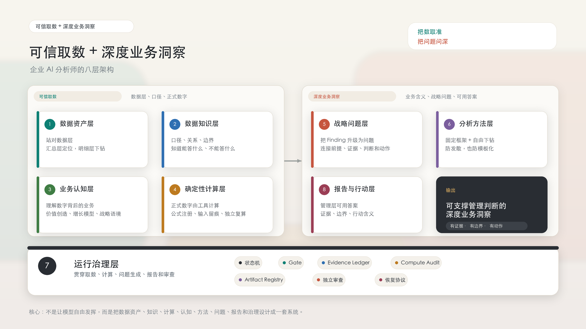

# 可信取数+深度业务洞察：企业 AI 分析师的八层架构

> 把数取准，把问题问深。
>

> 说明：本文案例均为合成示例，不对应任何真实业务、真实指标、真实数据表或内部系统。
>

作者：Eric Young-ANT Group（Ericyang.nna@gmail.com）

## 1. 核心不是 Text-to-SQL，而是可信取数和深度业务洞察
过去两年，企业做 AI 数据分析，经常会先盯住一个问题：能不能把一句自然语言，准确翻译成 SQL？

这个问题重要，但它不是核心。企业 AI 分析的核心，不是 Text-to-SQL，也不是把 Dashboard 换成聊天框，而是让它在受治理的数据资产、数据知识、确定性计算和业务认知之上，把数取准，把问题问深，最终形成能支撑管理判断的深度业务洞察。

这不是否定 Text-to-SQL。它当然重要，但它只是入口，不是完整的分析能力。

这句话里真正要抓住的是两件事：把数取准，把问题问深。

取数准，不是把数据库接给模型就自然发生。AI 要知道该站在哪一层数据上，指标口径是什么，什么时候能比、什么时候不能比，派生指标由谁算，哪些问题不能直接回答、必须澄清、补证或降级。问题问深，也不是把摘要写长一点、把报告写漂亮一点，而是把数据变化放回业务里，回答一句更难的话：这件事迫使我们重新判断什么？

真实企业分析不是“一句话问题 -> 一条 SQL -> 一个图表”。它至少包含一串连续判断：应该用汇总层还是明细层？指标能否跨周期比较？变化来自真实改善还是结构迁移？当前证据挑战了哪个业务假设？管理层应该改变资源、节奏、目标还是验证方向？

看一个例子（以下数字都是指数，不对应任何真实业务数据）

某会员业务本期活跃用户指数从 100 上升到 128。一个低质量 AI 很容易写出这样的结论：

> 本期活跃用户增长明显，说明会员运营策略有效，建议继续加大投放。
>

这个结论的问题不只是“浅”。它把一个总量指标直接当成业务质量证据，又跳过了价值行为、留存和结构变化。

如果同时看到高价值行为指数只从 100 上升到 103，人均高价值行为指数从 100 下降到 80，次周期留存指数从 100 下降到 91，真正的问题就不是“活跃有没有增长”，而是：

> 当前增长是在扩大真实高价值会员基础，还是在用低持续性的活跃指标掩盖增长质量下降？
>

这就是本文要讨论的核心：把数取准，把问题问深。前者防止 AI 第一步就站错证据，后者防止 AI 把表层变化包装成洞察。

## 2. 为什么这是一个系统问题
企业 AI 分析真正难的地方，不在某一个单点能力，而在每一步都要接得上。

第一，数从哪里来、准不准要说得清。AI 要知道用哪一层数据、遵守什么口径、哪些指标可以比较，哪些问题不能直接回答、必须澄清、补证或降级。否则它可能第一步就站错证据。

近年的 [Spider 2.0](https://arxiv.org/abs/2411.07763)、[EntSQL](https://arxiv.org/abs/2606.03363) 和 [Beyond Text-to-SQL](https://arxiv.org/abs/2605.21027) 也在说明同一个趋势：真实场景里，模型面对的不只是 SQL 语法，还有元数据、业务文档、内部规则、多步交互和受治理接口。对企业来说，结论很简单：让模型直接写 SQL，只覆盖了分析链路里很窄的一段。

第二，数字意味着什么要说得清。AI 不能只把指标变化写成摘要，还要把变化放进业务前提、解释空间和管理动作里。否则它会把表层 Finding 包装成洞察。

第三，过程要管得住。证据、计算、问题生成、报告语言都要被约束和审查。否则 prompt 写得再完整，也会在长流程里漂移。

所以，下一阶段的竞争不只是“谁的 SQL 生成更准”，而是“谁能把取数、业务认知和运行治理串起来，稳定产出深度业务洞察”。

这篇总论先把三件事讲清楚：

1. 企业 AI 分析的目标，不应停在 Text-to-SQL，而应走向“可信取数 + 深度业务洞察”。
2. 要做到这一点，需要把数据资产、数据知识、确定性计算、业务认知、分析方法、战略问题、报告行动和运行治理放进同一张图。
3. 真正有价值的 AI 分析系统，要把数取准，把问题问深，并且让关键结论有证据、有边界、能进入管理讨论。

## 3. 一个更准确的系统目标：Governed Insight Generation
我把这个方向称为 Governed Insight Generation：受治理的洞察生成。

它不是更会聊天的 dashboard，也不是更强的 SQL 生成器。更准确地说，它是一套企业 AI 分析的生产方式：先把数据、口径、计算、业务认知和证据链管起来，再让 AI 在这条链路上生成能支撑管理判断的深度业务洞察。

一些新的评测也开始关注 business analytics agent 的多步洞察生成，而不只是单个 query 的正确性，例如 [InsightBench](https://proceedings.iclr.cc/paper_files/paper/2025/hash/0dfe31d6e703e138d46a7d2fced38b7c-Abstract-Conference.html)。但对企业来说，问题更具体：谁来保证数据可信，谁来保证计算可信，谁来保证洞察不是编出来的？

这个概念也来自实践。我们在企业 AI 分析系统建设中做过一组脱敏评测：同样的问题、同样的模型，只要数据层、数据知识、业务认知和分析流程不同，输出质量就会明显变化。只给原始明细，AI 容易被口径、关联和计算拖住；只给汇总指标，AI 又很难解释异常；缺少业务认知，AI 会把指标变化误读成经营判断；缺少运行治理，AI 可能在没有证据的情况下下结论，甚至在正文里心算正式指标。把稳定指标、可下钻明细、数据知识、确定性计算、业务认知和运行时审查组合起来，结果才更接近管理层真正能用的分析。

它和常见形态的差异如下：

| 形态 | 核心能力 | 价值 | 不足 |
| --- | --- | --- | --- |
| Text-to-SQL | 自然语言转查询 | 降低问数门槛 | 不负责业务判断、问题生成和报告治理 |
| Conversational BI | 对话式看图和追问 | 提升 dashboard 交互效率 | 不一定主动组织证据和形成管理问题 |
| Semantic Layer Copilot | 指标、维度、关系语义映射 | 降低 schema 误用和口径错误 | 仍不等于业务认知和战略判断 |
| Governed Insight Generation | 受治理的洞察生成链路 | 可信取数 + 深度业务洞察 | 不能替代业务负责人决策，不能跳过证据审查 |

一句话说：Text-to-SQL 解决的是“从语言到查询”，语义层解决的是“从查询到正确口径”，Governed Insight Generation 要解决的是“怎么把证据一步步变成能支撑管理判断的深度业务洞察”。

## 4. 八层架构
要做到这件事，至少要补齐八层能力。

| 层级 | 核心问题 | 常见失败模式 | 系统解法 |
| --- | --- | --- | --- |
| 1. 数据资产层 | AI 应站在哪些数据上？ | 直接站在原始明细上，成本高、口径复杂、难以复现 | 区分简单问数和复杂分析；复杂分析使用稳定汇总层 + 可下钻明细层 |
| 2. 数据知识层 | AI 如何知道表、字段、指标怎么用？ | 字段名看懂了，但聚合方式、关系和边界错了 | 建设口径、用途、关系、下钻路由和不能直接回答的范围 |
| 3. 业务认知层 | AI 如何理解数字背后的业务？ | 只复述变化，编造原因，不能判断业务含义 | 建设业务身份、价值创造、经济模型、增长模型和战略语境 |
| 4. 确定性计算层 | 正式数字应该由谁计算？ | LLM 心算同比、环比、占比、贡献率 | 工具计算、公式注册、输入输出留痕、独立复算 |
| 5. 战略问题层 | AI 如何提出真正该问的问题？ | 把 Finding 包装成标题 | 连接业务前提、当前证据、判断空间和管理动作 |
| 6. 分析方法层 | AI 如何既不漂移也不僵化？ | 纯自由探索发散，纯固定模板浅表 | 固定分析框架 + 自由下钻 |
| 7. 运行治理层 | AI 如何被约束和审查？ | Prompt 写了要求，但执行过程漂移 | 状态机、Gate、Evidence Ledger、artifact、独立审查和恢复协议 |
| 8. 报告与行动层 | 报告能否被管理层使用？ | 看似完整，但无答案、无边界、无行动含义 | Answer Card、证据边界、行动含义和管理判断 |

这八层不是八个功能模块，而是八个必须有人负责做对的环节。任何一层缺失，AI 都可能写出看似合理、实际不可用的分析。

这张图也是后续系列文章的路线图。总论之后，系列会按一个从底座到交付的顺序展开：

1. 数据资产层：AI 应该站在哪一层数据上？
2. 数据知识层：AI 如何理解口径、用途、关系、下钻路由和回答边界？
3. 业务认知层：数查到了以后，AI 如何理解它背后的业务含义？
4. 确定性计算层：正式经营数字为什么不能交给 LLM 心算？
5. 战略问题层：Finding 如何升级为 Strategic Question？
6. 分析方法层：固定框架和自由下钻如何配合？
7. 运行治理层：如何用 Harness Engineering 把证据、计算、审查和恢复机制管起来？
8. 报告与行动层：如何把分析结果写成管理层能使用的答案？

换句话说，本文先给地图；后续每篇文章拆开一个关键环节，讲清楚它为什么重要、最容易在哪里失败、系统上应该怎么补。

## 5. 三个最容易被低估的层
第一，数据知识层不是元数据。字段说明只能告诉 AI “这里有什么”。真正的数据知识库还要告诉 AI：这个指标该怎么算、什么时候能用、什么时候不能用、汇总异常时应该下钻到哪里。

从 [Snowflake Semantic Views](https://docs.snowflake.com/en/user-guide/views-semantic/overview)、[Databricks Genie](https://docs.databricks.com/aws/en/genie) 到 [Quick BI 智能小Q](https://help.aliyun.com/zh/quick-bi/product-overview/intelligentq) 和 [火山引擎智能问数 Agent](https://www.volcengine.com/docs/86760/1874851?lang=zh)，很多产品都在把指标、关系、业务知识和可验证过程前置；这至少说明一件事：只把 schema 给模型，已经不够了。

第二，业务认知层不是术语表。语义层解决数据和语言的映射，业务认知解决数字和管理判断的连接。AI 需要知道什么是好增长、什么是坏增长，短期收入和长期质量有什么差异，哪些指标只是表层结果，哪些指标代表业务成立前提。

第三，战略问题层不是标题生成。Finding 是“发生了什么”，Strategic Question 是“这件事迫使我们重新判断什么”。如果一个问题不能改变资源、节奏、目标或边界，它通常只是漂亮标题。

## 6. 为什么 Prompt 不够
很多 AI 分析系统的问题，不是 prompt 没写清楚，而是没有把要求变成约束。你可以在 prompt 里写“不要编造”“先看证据”“计算要准确”“不确定要说明边界”，但如果这些要求没有落到状态、产物、Gate 和审查里，它们就只是愿望。

企业 AI 分析需要 Harness Engineering：把关键分析行为管起来。

这类问题在 agent 研究里也越来越常见，从 [PROV-AGENT](https://arxiv.org/abs/2508.02866)、[SafeAgent](https://arxiv.org/abs/2604.17562) 到 [From Agent Traces to Trust](https://arxiv.org/abs/2606.04990)，关注点都在从“结果对不对”走向“过程能不能追踪、保护和审计”。对企业分析来说，这句话很实在：可信不是最后一句“我检查过了”，而是全过程可追踪、可阻断、可恢复。

落到系统里，至少要有这些机制：

+ Evidence Ledger：每个结论必须绑定证据来源。
+ Fresh Run Isolation：当前事实来自本轮证据，历史知识只能提供语境。
+ Compute Audit：正式派生指标由工具计算，并可独立复算。
+ Gate：不合格产物不能进入下一阶段。
+ Artifact Registry：关键中间产物必须落盘，不能只留在对话里。
+ Independent Review：审查不能由同一个主 session 自评替代。
+ Recovery Protocol：证据不足、计算失败、审查不通过时，系统知道如何阻断、修复或降级。

Prompt 只能表达意图，Harness 才能约束行为。

## 7. 边界
Governed Insight Generation 不是否定 Text-to-SQL，也不是否定语义层。Text-to-SQL 仍然是重要入口，语义层仍然是必要基础，BI Copilot 也会继续提升数据交互效率。

问题在于，它们不是完整答案。如果目标只是让用户更快看到某个指标，自然语言问数已经很有价值。但如果目标是让 AI 参与真实经营分析，帮助团队发现问题、形成判断、沉淀认知、输出管理层可用报告，系统就必须往更深处走。

这套架构也不能替代业务负责人做决策。它能做的是把证据组织得更清楚，把问题提出得更早，把分析过程治理得更可靠。

## 8. 结论
下一代企业 AI 分析不会只是一个更会聊天的 dashboard，也不会只是一个更准的 SQL 生成器。

它会更像一套受治理的洞察生产系统：能站对数据层，能遵守口径和边界，能用确定性工具计算正式数字，能把指标变化放进业务认知里，能提出真正值得管理层讨论的问题，并把答案写成有证据、有边界、有行动含义的报告。

所以，这套架构的关键不是让 AI “更会说”，而是让 AI 在系统约束下完成两件难事：把数取准，把问题问深。

这不是 BI 交互的一次小升级，而是企业分析生产方式的一次变化：从把模型接到数据入口，走向建设一个能稳定产出深度业务洞察的分析系统。

## 参考来源
+ [Spider 2.0](https://arxiv.org/abs/2411.07763)
+ [EntSQL](https://arxiv.org/abs/2606.03363)
+ [Beyond Text-to-SQL](https://arxiv.org/abs/2605.21027)
+ [Snowflake Semantic Views](https://docs.snowflake.com/en/user-guide/views-semantic/overview)
+ [Databricks AI/BI Genie](https://docs.databricks.com/aws/en/genie)
+ [Quick BI 智能小Q](https://help.aliyun.com/zh/quick-bi/product-overview/intelligentq)
+ [火山引擎智能问数 Agent](https://www.volcengine.com/docs/86760/1874851?lang=zh)
+ [InsightBench](https://proceedings.iclr.cc/paper_files/paper/2025/hash/0dfe31d6e703e138d46a7d2fced38b7c-Abstract-Conference.html)
+ [PROV-AGENT](https://arxiv.org/abs/2508.02866)
+ [SafeAgent](https://arxiv.org/abs/2604.17562)
+ [From Agent Traces to Trust](https://arxiv.org/abs/2606.04990)
